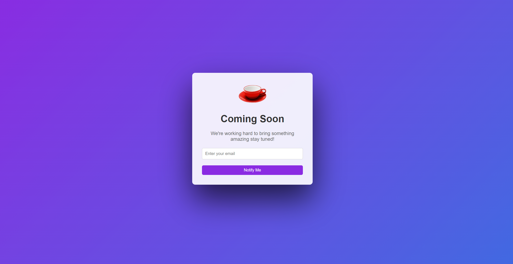

# Coming Soon Template Page

This is a simple sign-up page created using HTML and CSS. The page features a responsive design and interactive elements, such as styled buttons and form inputs.



---

## Features

- **Responsive Design**:
  - The page is styled to be centered and responsive using `flexbox`.

- **Interactive Elements**:
  - Includes hover effects for buttons.

- **User-Friendly Form**:
  - Inputs for email, first name, last name, and password.
  - "First Name" and "Last Name" are aligned horizontally for better usability.

---

## Technologies Used

- **HTML**: For the structure of the webpage.
- **CSS**: For styling and layout.

---

## How to Use

1. Clone the repository:
   ```bash
   git clone https://github.com/anishsharma573/Web_development_hitesh_choudhary_udemy.git
